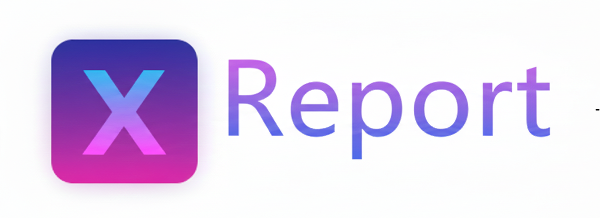
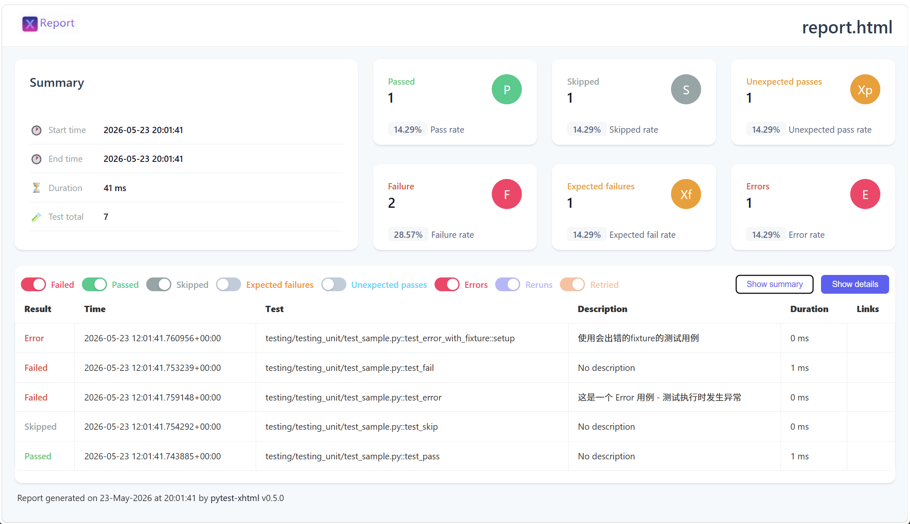
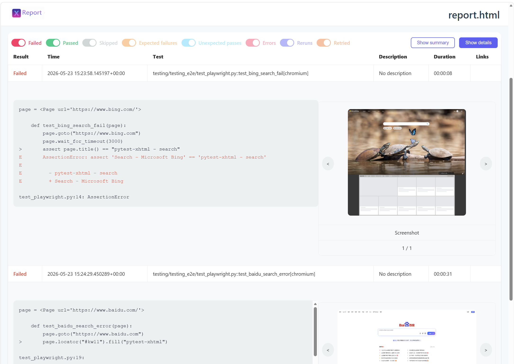
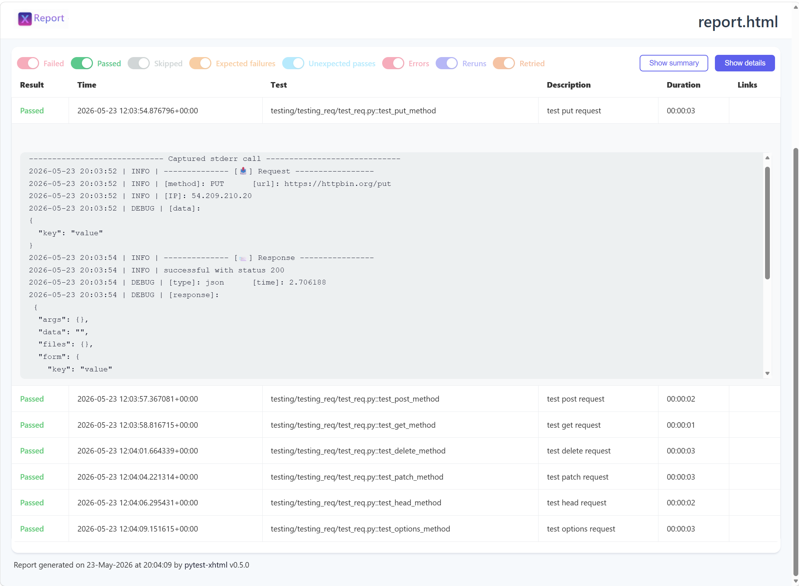

# pytest-xhtml



pytest-xhtml is a plugin for `pytest` that generates a HTML report for test results.

> ⚠️ **`pytest-xhtml` is the alternative library for `pytest-html`. If you have installed `pytest-html`, please uninstall it first.**

## install

```bash
# pip install
pip install pytest-xhtml
```

## usage

* unit test

```bash
cd testing_unit
pytest test_sample.py --html=report.html
```



* e2e test

```bash
# install playwright library
pip install pytest-playwright
playwright install chromium

cd testing_e2e
pytest test_playwright.py --html=report.html
```



* http test

```bash
# install pytest-req library
pip install pytest-req

cd testing_req
pytest test_req.py --html=report.html
```




## VS pytest-html

pytest-xhtml is fully compatible with pytest-html. The only difference is a more beautiful UI style.

| Feature | pytest-html | pytest-xhtml |
|---|---|---|
| UI Style | Traditional table layout | ✨ Modern card-based dashboard (More beautiful!) |
| Generate HTML Report | `pytest --html=report.html` | 🟰 |
| Self-contained Report | `pytest --html=report.html --self-contained-html` | 🟰 |
| Custom CSS | `pytest --html=report.html --css=style.css` | 🟰 |
| Report Streaming | `generate_report_on_test = true` (pytest.ini) | 🟰 |
| Environment Redaction | `environment_table_redact_list` (regex) | 🟰 |
| Collapsed Rows | `render_collapsed = passed,failed` (pytest.ini) | 🟰 |
| Initial Sort | `initial_sort = result` (pytest.ini) | 🟰 |
| Hook: Report Title | `pytest_html_report_title(report)` | 🟰 (rename to `pytest_xhtml_*`) |
| Hook: Results Summary | `pytest_html_results_summary(prefix, summary, postfix)` | 🟰 (rename to `pytest_xhtml_*`) |
| Hook: Table Header | `pytest_html_results_table_header(cells)` | 🟰 (rename to `pytest_xhtml_*`) |
| Hook: Table Row | `pytest_html_results_table_row(report, cells)` | 🟰 (rename to `pytest_xhtml_*`) |
| Hook: Table HTML | `pytest_html_results_table_html(report, data)` | 🟰 (rename to `pytest_xhtml_*`) |
| Hook: Duration Format | `pytest_html_duration_format(duration)` | 🟰 (rename to `pytest_xhtml_*`) |
| Extras: HTML | `extras.html('<div>...</div>')` | 🟰 |
| Extras: JSON | `extras.json({'name': 'pytest'})` | 🟰 |
| Extras: Text | `extras.text('some text')` | 🟰 |
| Extras: URL | `extras.url('http://example.com/')` | 🟰 |
| Extras: Image | `extras.image(path_or_data, mime_type, ext)` | 🟰 |
| Extras: PNG/JPG/SVG | `extras.png()` / `extras.jpg()` / `extras.svg()` | 🟰 |
| Extras Fixture | `def test_x(extras):` | 🟰 |
| ANSI Code Support | Via `ansi2html` (optional) | 🟰 |


## Develop

```bash
# develop 
git clone https://github.com/seldomQA/pytest-xhtml.git
cd pytest-xhtml
pip install .
```